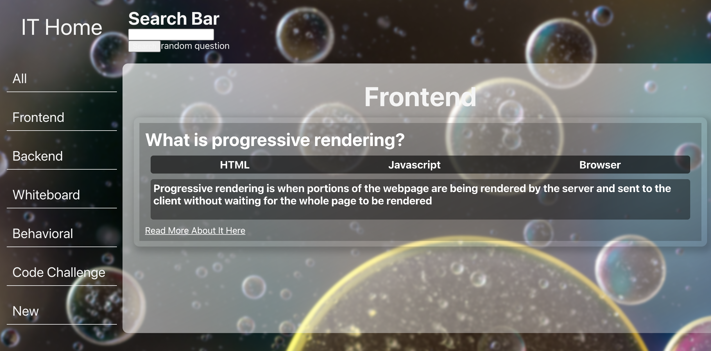

<!-- PROJECT LOGO -->
<br />
<p align="center">
  <a href="https://github.com/othneildrew/Best-README-Template">
    <!--  -->
  </a>

  <h3 align="center">Interview Trivia</h3>

  <p align="center">
    Test yourself
    <br />
    <a href="https://github.com/chris-a-phillips/interview-trivia/blob/main/README.md"><strong>Explore the docs »</strong></a>
    <br />
    <br />
    <a href="https://github.com/chris-a-phillips/interview-trivia">View Demo</a>
    ·
    <a href="https://github.com/chris-a-phillips/interview-trivia/issues">Report Bug</a>
    ·
    <a href="https://github.com/chris-a-phillips/interview-trivia/issues">Request Feature</a>
  </p>
</p>


<!-- TABLE OF CONTENTS -->
<details open="open">
  <summary>Table of Contents</summary>
  <ol>
    <li>
      <a href="#about-the-project">About The Project</a>
      <ul>
        <li><a href="#built-with">Built With</a></li>
      </ul>
    </li>
    <li>
      <a href="#getting-started">Getting Started</a>
      <ul>
        <li><a href="#prerequisites">Prerequisites</a></li>
        <li><a href="#installation">Installation</a></li>
      </ul>
    </li>
    <li><a href="#roadmap">Roadmap</a></li>
    <li><a href="#contributing">Contributing</a></li>
    <li><a href="#contact">Contact</a></li>
    <li><a href="#acknowledgements">Acknowledgements</a></li>
  </ol>
</details>


<!-- ABOUT THE PROJECT -->
## About The Project

<!--[Product Name Screen Shot][product-screenshot]](https://example.com) -->


    <br/>

This is a simple MERN application for testing your knowledge of general concepts based around software engineering.

The main functionality includes:
* Frontend React app styled using basic CSS for a glassmorphism effect
* Frontend that is connected to backend using axios with functionality to create and read data using RESTful routes
* Backend Express using Mongoose for schemas to questions

This can be used for anyone on their journey in software engineering. Although it was created with the purpose of preparing for interviews, it can be used as a way to do basic trivia. It was created with frontend, backend, behavioral, and whiteboarding questions in mind. It will continue to grow with questions about different topics and more ways to visualize the information.


### Built With

* [Mongoose](https://mongoosejs.com/)
* [Express](https://expressjs.com/)
* [React](https://reactjs.org/)
* [Node](https://nodejs.org/en/)


<!-- GETTING STARTED -->
## Getting Started

This is an example of how you may give instructions on setting up your project locally.
To get a local copy up and running follow these simple example steps.

### Prerequisites

This is an example of how to list things you need to use the software and how to install them.
* npm
  ```sh
  npm install npm@latest -g
  ```

### Installation

1. Clone the repo
   ```sh
   git clone https://github.com/chris-a-phillips/interview-trivia.git
   ```
2. Install NPM packages
   ```sh
   npm install
   ```


<!-- ROADMAP -->
## Roadmap

See the [open issues](https://github.com/chris-a-phillips/interview-trivia/issues) for a list of proposed features (and known issues).


<!-- CONTRIBUTING -->
## Contributing

Contributions are what make the open source community such an amazing place to be learn, inspire, and create. Any contributions you make are **greatly appreciated**.

1. Fork the Project
2. Create your Feature Branch (`git checkout -b feature/AmazingFeature`)
3. Commit your Changes (`git commit -m 'Add some AmazingFeature'`)
4. Push to the Branch (`git push origin feature/AmazingFeature`)
5. Open a Pull Request

<!-- CONTACT -->
## Contact

Chris Phillips - [Chris Phillips LinkedIn](https://www.linkedin.com/in/chris-a-phillips/) - phillipsachris@gmail.com

Project Link: [https://github.com/chris-a-phillips/interview-trivia](https://github.com/chris-a-phillips/interview-trivia)
